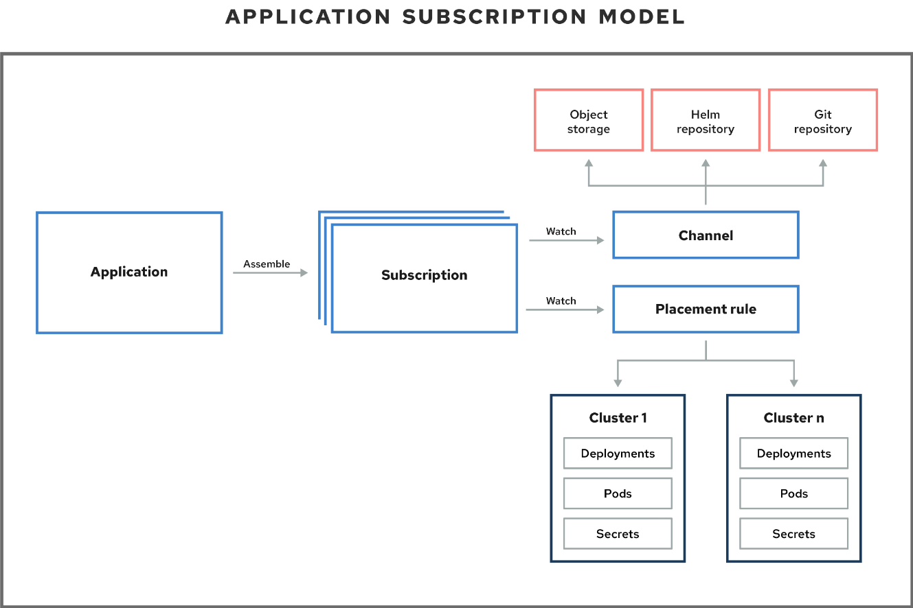

Gitlab integration with ACM





Edit secrets.yaml
git update-index --assume-unchanged secrets.yaml

Create project and namespace
```sh
oc create -f multi-cloud/app.yaml -f multi-cloud/secrets.yaml --save-config
```

Create Access Token with api role
```sh
token=--add-token-here--
email=--add-email-here--
oc project gitlab-auth
oc delete secret gitlab-registry-auth
oc delete secret gitlab-repo-auth
kubectl create secret docker-registry gitlab-registry-auth \
        --docker-server=registry.gitlab.com \
        --docker-username=openshift-token\
        --docker-password=$token\
        --docker-email=$email
kubectl create secret docker-registry gitlab-repo-auth \
        --docker-server=gitlab.com \
        --docker-username=openshift-token\
        --docker-password=$token\
        --docker-email=$email
oc secrets link default gitlab-registry-auth --for=pull
oc secrets link default gitlab-repo-auth --for=pull
gitlabRegistryAuth=$(oc get secret gitlab-registry-auth -o=jsonpath='{ .data.\.dockerconfigjson }')
gitlabRepoAuth=$(oc get secret gitlab-repo-auth -o=jsonpath='{ .data.\.dockerconfigjson }')
perl -pe "s/GITLAB_REGISTRY_AUTH/$gitlabRegistryAuth/" secrets.yaml.tmpl | \
perl -pe "s/GITLAB_REPO_AUTH/$gitlabRepoAuth/" |
perl -pe "s/GITLAB_ACCESS_TOKEN/$token/"> secrets.yaml
```

```sh
oc create -f secrets.yaml --save-config -n gitlab-auth
oc secrets link default gitlab-access-token --for=pull -n gitlab-auth
```
